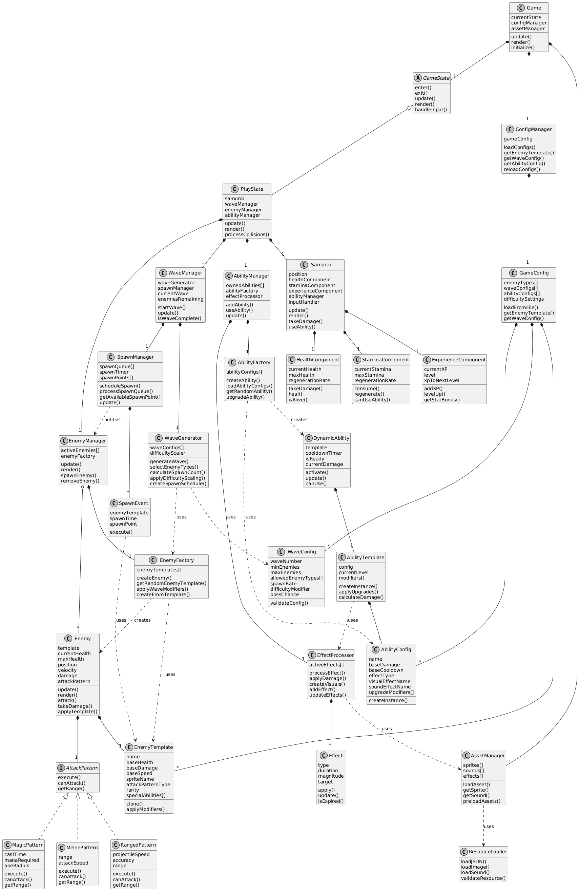
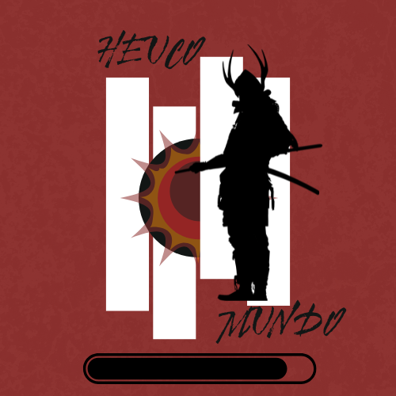
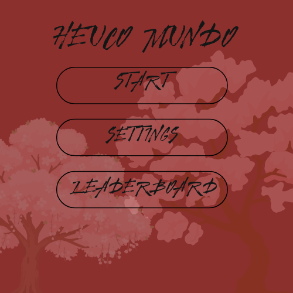
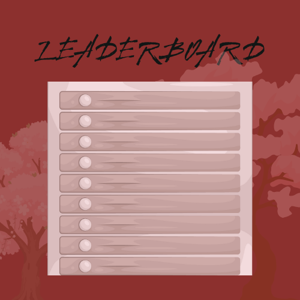
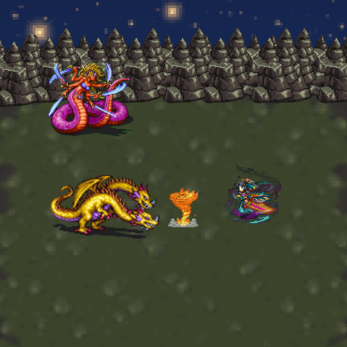

# Final Project

-   [ ] Read the [project requirements](https://vikramsinghmtl.github.io/420-5P6-Game-Programming/project/requirements).
-   [ ] Replace the sample proposal below with the one for your game idea.
-   [ ] Get the proposal greenlit by Vik.
-   [ ] Place any assets in `assets/` and remember to update `src/config.json`.
-   [ ] Decide on a height and width inside `src/globals.js`. The height and width will most likely be determined based on the size of the assets you find.
-   [ ] Start building the individual components of your game, constantly referring to the proposal you wrote to keep yourself on track.
-   [ ] Good luck, you got this!

---

# Sample Proposal - Pokémon the Trading Card Game

> [!note]
> This was taken from a project I did in university so the scope is **much** larger than what I'm expecting from you in terms of number of features!

## ✒️ Description

In this single-player survival action game, players control a masterful samurai warrior defending against endless waves of enemies. Armed with ancient blade techniques and mystical abilities, the samurai must survive increasingly difficult rounds of spawning monsters. The warrior can unleash devastating elemental attacks like blazing fire waves and whirling tornadoes, while using swift dashes to reposition and avoid overwhelming odds. Strategic use of blocking, dodging, and well-timed healing creates a dynamic combat experience where both offense and defense are crucial for survival.

## 🕹️ Gameplay

(might change some of the mechanics)
Core Combat System:
Basic Attack: Left-click for sword strikes with potential combo chains
Movement: WASD keys for directional movement around the battlefield
Dash: Right-click or Shift key for quick directional dashes (short cooldown)
Block: Hold E to raise guard, reducing incoming damage (limited stamina/duration)
Dodge Roll: Spacebar for evasive roll with brief invincibility frames (cooldown required)

Special Abilities (Number Keys 1-4):
Fire Wave: Shoots a blazing wave of fire in target direction, burning enemies in its path
Whirlwind Tornado: Creates a spinning tornado that travels forward, dealing continuous damage
[Additional abilities to be designed]: Could include healing aura, lightning strikes, etc.

Healing Mechanics:
Heal when completing a wave without taking damage (perfect round bonus)
Small health recovery after defeating mini-boss enemies
Possible healing ability unlock at higher levels

Round Structure:
Wave Start: Enemies spawn from multiple points around the map edges
Combat: Player fights using all available abilities and techniques
Wave Complete: Brief intermission with healing opportunities
Level Up: Gain experience to unlock new abilities or upgrade existing ones
Next Wave: More enemies with increased health/damage spawn

Progression System:
Experience gained from enemy kills and wave completion
Ability tree allowing players to unlock and upgrade samurai techniques
Each level offers choices between different upgrade paths

## 📃 Requirements

1. Game Initialization & Setup
1.1. The system shall start the game with the samurai at full health in the center of the battlefield.
1.2. The system shall initialize Wave 1 with a randomized selection of early-tier enemies.
1.3. The system shall display the current wave number, player health, and experience points on the HUD.
1.4. The system shall spawn the first wave of enemies at designated spawn points around the map edges.

2. Movement & Basic Controls
2.1. The user shall move the samurai in four directions using WASD keys.
2.2. The user shall perform a dash in any direction using Right-click or Shift key.
2.3. The system shall apply a cooldown period after each dash to prevent spam.
2.4. The user shall perform a dodge roll using the Spacebar key.
2.5. The system shall provide brief invincibility frames during the dodge roll animation.
2.6. The system shall apply a cooldown period after each dodge roll.

3. Combat System
3.1. The user shall attack enemies by left-clicking the mouse.
3.2. The system shall deal damage to enemies within the samurai's sword range.
3.3. The user shall block incoming attacks by holding the E key.
3.4. The system shall reduce incoming damage while blocking is active.
3.5. The system shall limit blocking duration through a stamina system.
3.6. The system shall regenerate stamina when not blocking.

4. Special Abilities & Orb Collection
4.1. The system shall spawn ability orbs randomly around the map during each wave.
4.2. The user shall collect ability orbs by moving the samurai over them.
4.3. The user shall activate Fire Wave ability using the 1 key after collecting the corresponding orb.
4.4. The user shall activate Tornado ability using the 2 key after collecting the corresponding orb.
4.5. The system shall upgrade abilities when the user collects multiple orbs of the same type.
4.6. The system shall limit the number of ability orbs spawned per wave.

5. Enemy System & Waves
5.1. The system shall spawn enemies randomly from designated spawn points around the map.
5.2. The system shall ensure early waves (1-5) contain only basic enemies (goblins, skeletons).
5.3. The system shall introduce mid-tier enemies (orcs, knights, archers) starting from wave 6.
5.4. The system shall introduce high-tier enemies (wizards, elite warriors) starting from wave 16.
5.5. The system shall increase enemy health and damage with each subsequent wave.
5.6. The system shall increase the number of enemies spawned with each wave progression.

6. Wave Progression & Completion
6.1. The system shall detect when all enemies in the current wave are defeated.
6.2. The system shall provide a brief intermission period between waves.
6.3. The system shall advance to the next wave automatically after the intermission.
6.4. The system shall award experience points upon wave completion.

7. Healing & Health Management
7.1. The system shall restore partial health when completing a wave without taking damage.
7.2. The system shall provide small health recovery after defeating mini-boss type enemies.
7.3. The system shall display current health status on the HUD at all times.

8. Progression & Leveling
8.1. The system shall award experience points for each enemy defeated.
8.2. The system shall allow the user to level up when sufficient experience is gained.
8.3. The system shall provide upgrade choices for health, stamina, or ability power upon leveling.
8.4. The system shall save the current level and stats throughout the game session.

9. Game End Conditions
9.1. The system shall end the game when the samurai's health reaches zero.
9.2. The system shall display the final wave reached and total score upon game over.
9.3. The system shall allow the user to restart the game from the beginning.

10. User Interface
10.1. The system shall display current wave number, health, experience, and available abilities on screen.
10.2. The system shall show cooldown timers for dash, dodge, and special abilities.
10.3. The system shall provide visual feedback when collecting orbs or taking damage.

### 🤖 State Diagram

> [!note]
> Remember that you'll need diagrams for not only game states but entity states as well.

### 🗺️ Class Diagram

### 🧵 Wireframes

> [!note]
> Sprite sheet for characters, enemies and animations will be taken from these sprite sheets:
> https://www.spriters-resource.com/mobile/finalfantasybraveexvius/asset/194038/
> https://www.spriters-resource.com/game_boy_advance/finalfantasy1dawnofsouls/asset/25295/

- On entry, or between screens such as _Start_ where entities/data have to be loaded, will display this loading screen

- Simple main menu _Start_ button to start game, _Settings_ button, _Leaderboard_ button to see historical plays (idea would be to store the score in the local storage, cookies or something similar)

- Settings page to control sounds, music, and game mode from easy, medium or hard, button to go back to main menu

- Leaderboard for the user to track their score each time they play

I plan to create a custom map using assets from a series of tilemaps and putting them together, attached is an example i put together using assets from each tile map 
-https://kepx.itch.io/pixel-houses-rpg-top-down-pixel-art-asset-pack-16x16?download
-https://snowhex.itch.io/dungeon-gathering-fire-zone-expansion/download/eyJpZCI6MjYxMzIwNywiZXhwaXJlcyI6MTc2NDYxODE3N30%3d.DidqHUmieZ6dU24KR6qiyWL8oCE%3d
-https://ninjikin.itch.io/starter-tiles?download
-https://szadiart.itch.io/rpg-worlds-ca/download/eyJpZCI6NjEwOTUzLCJleHBpcmVzIjoxNzY0NjE4MTY2fQ%3d%3d.pf5lthOWJ77eglIuCETQbYmAsiM%3d

### 🎨 Assets & 🖼️ Images

Miro for the diagrams, Canva to create wireframes, the loading screen i took a base template and modified it  
sprites for game:
> https://www.spriters-resource.com/mobile/finalfantasybraveexvius/asset/194038/
> https://www.spriters-resource.com/game_boy_advance/finalfantasy1dawnofsouls/asset/25295/
fonts:
> https://en.bestfonts.pro/font/kurut 
> https://fonts.google.com/specimen/League+Spartan

#### 🔊 Sounds

- background music will be ( https://www.youtube.com/watch?v=T7k3l7iKflo ) - more to be added

sword swoosh
> https://pixabay.com/sound-effects/sword-slice-393847/

sword hitting enemy
> https://pixabay.com/sound-effects/sword-blade-slicing-flesh-352708/
> https://pixabay.com/sound-effects/fantasy-game-sword-cut-sound-effect-get-more-on-my-patreon-339824/
> https://pixabay.com/sound-effects/rpg-sword-attack-combo-34-388950/

player taking damage
> https://pixabay.com/sound-effects/bone-breaking-393842/

blocking sounds
>blocking https://pixabay.com/sound-effects/armor-impact-from-sword-393843/
>enemy death https://pixabay.com/sound-effects/violent-sword-slice-2-393841/
>player death 1 https://pixabay.com/sound-effects/sword-breaking-sound-effect-393840/
>player death 2 https://pixabay.com/sound-effects/sword-clattering-to-the-ground-393838/

special attack sounds
> https://pixabay.com/sound-effects/earth-magic-5-378598/
> https://pixabay.com/sound-effects/search/magic%20attack/?pagi=2
> https://pixabay.com/sound-effects/elemental-magic-spell-impact-outgoing-228342/
> https://pixabay.com/sound-effects/fireball-impact-351961/
> https://pixabay.com/sound-effects/fireball-whoosh-2-179126/
> https://pixabay.com/sound-effects/explosion-3-274684/
> https://pixabay.com/sound-effects/rpg-sword-attack-combo-31-388958/ 

### 📚 References

-   [Pokemon Rulebook](http://assets.pokemon.com/assets/cms2/pdf/trading-card-game/rulebook/xy8-rulebook-en.pdf)
